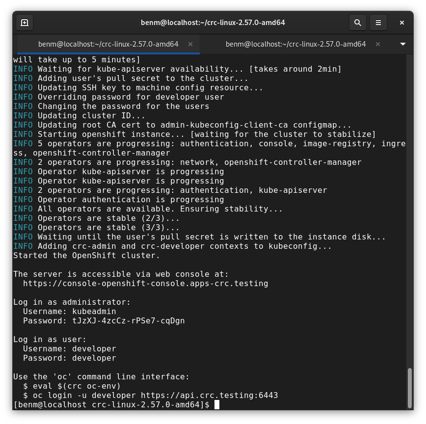

# RHEL9 KVM/QEMU Setup Guide

Quick reference for extending disk space on RHEL9 virtual machines and installing OpenShift Local for development.



---

## Part A: Extending Disk Space on RHEL9 VM

### Prerequisites
- RHEL9 VM running under KVM/QEMU on Ubuntu host
- Root/sudo access on both host and guest

### Step 1: Increase Virtual Disk Size (Ubuntu Host)

```bash
# Shut down the VM first
sudo virsh shutdown rhel9

# Find your VM's disk image path
sudo virsh domblklist rhel9

# Increase disk size (example: resize to 180GB total or add +50G)
sudo qemu-img resize /path/to/rhel9.qcow2 180G
# OR to add space:
sudo qemu-img resize /path/to/rhel9.qcow2 +50G

# Start the VM
sudo virsh start rhel9
```

### Step 2: Extend Partition (Inside RHEL9 VM)

```bash
# Check current disk layout
lsblk
df -h

# Install required tool
sudo dnf install -y cloud-utils-growpart

# Extend the partition (usually vda2 for LVM)
sudo growpart /dev/vda 2

# Verify partition grew
lsblk
```

### Step 3: Extend LVM Physical Volume

```bash
# Resize the physical volume
sudo pvresize /dev/vda2

# Check available space
sudo vgdisplay rhel
```

### Step 4: Extend Logical Volume and Filesystem

```bash
# Extend logical volume to use all free space
sudo lvextend -l +100%FREE /dev/rhel/root

# Resize the filesystem (XFS is RHEL9 default)
sudo xfs_growfs /

# Verify new size
df -h /
lsblk
```

**Note:** All operations in Steps 2-4 can be performed while the system is running.

---

## Part B: Installing OpenShift Local (CRC)

### Prerequisites
- RHEL9 system with minimum resources:
  - 16GB RAM (20GB+ recommended for eBPF workloads)
  - 6-8 CPU cores
  - 100GB+ disk space
- Red Hat account (free at https://developers.redhat.com)
- Pull secret from https://console.redhat.com/openshift/create/local

### Step 1: Download OpenShift Local

```bash
# Download the latest CRC release
wget https://developers.redhat.com/content-gateway/rest/mirror/pub/openshift-v4/clients/crc/latest/crc-linux-amd64.tar.xz

# Extract the archive
tar xvf crc-linux-amd64.tar.xz
cd crc-linux-*
```

### Step 2: Install CRC Binary

```bash
# Copy binary to system path
sudo cp crc /usr/local/bin/

# Verify installation
crc version
```

### Step 3: Setup and Configure

```bash
# Run initial setup (installs dependencies)
crc setup

# Configure resources (adjust based on your needs)
crc config set memory 16384      # 16GB RAM
crc config set cpus 6            # 6 CPU cores
crc config set disk-size 100     # 100GB disk
```

### Step 4: Start OpenShift Local

```bash
# Start CRC (will prompt for pull secret on first run)
crc start

# This takes 5-10 minutes - be patient!
# You'll see various operators starting and stabilizing
```

### Step 5: Access Your Cluster

```bash
# Set up oc command environment
eval $(crc oc-env)

# Login as developer
oc login -u developer -p developer https://api.crc.testing:6443

# Or login as admin
oc login -u kubeadmin https://api.crc.testing:6443
# (use the password displayed during 'crc start')

# Access web console
# URL shown after 'crc start': https://console-openshift-console.apps-crc.testing
```

### Useful CRC Commands

```bash
# Stop the cluster
crc stop

# Check cluster status
crc status

# Get console URL and credentials
crc console --credentials

# Delete and clean up
crc delete
crc cleanup
```

---

## Troubleshooting

### Disk Space Issues
- If partition doesn't show all space: Check host didn't run out of disk
- If `growpart` fails: Ensure partition is not mounted as read-only
- If XFS resize fails: Verify you're using `xfs_growfs` not `resize2fs`

### OpenShift Local Issues
- **CRC won't start**: Check available RAM with `free -h`
- **Nested virtualization**: Ensure enabled on Ubuntu host
  ```bash
  # Intel CPUs
  cat /sys/module/kvm_intel/parameters/nested
  # AMD CPUs  
  cat /sys/module/kvm_amd/parameters/nested
  ```
- **Network issues**: CRC uses its own networking, ensure no conflicts with existing VPNs

---

## Additional Resources

- OpenShift Local Documentation: https://crc.dev/crc/
- RHEL9 Documentation: https://access.redhat.com/documentation/en-us/red_hat_enterprise_linux/9
- Red Hat Developer Portal: https://developers.redhat.com
- OpenShift CLI Reference: https://docs.openshift.com/container-platform/latest/cli_reference/openshift_cli/getting-started-cli.html
